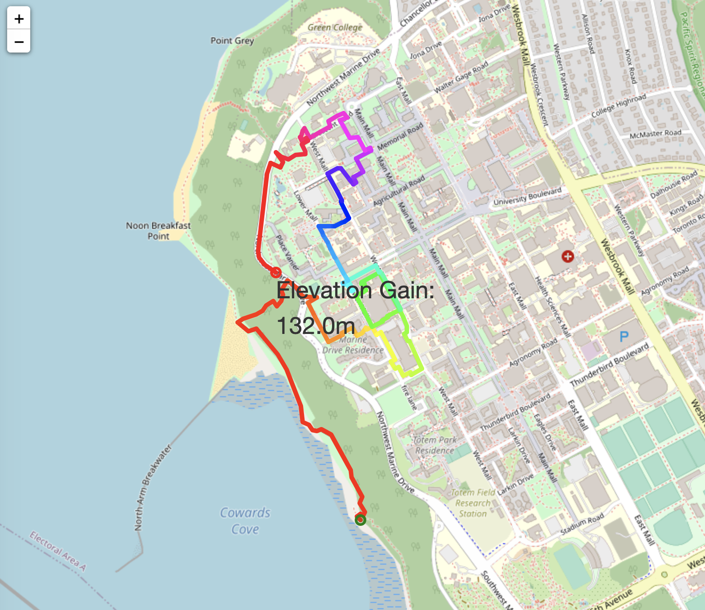
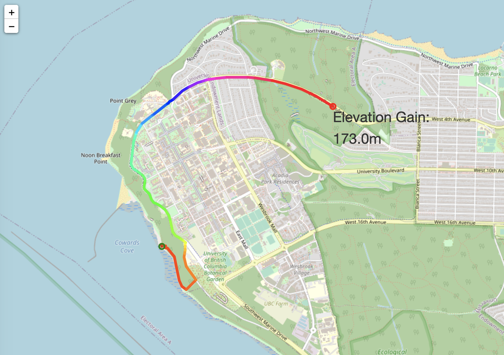

# Intro: Working with Map APIs

Map data is structured yet usually large scale and highly complex, so finding the right representation of a map can help us with designing algorithms that work efficiently. A common approach is to treat street maps as a graph with geolocated points as vertices and streets/paths as edges. We can then utilize graph algorithms to traverse and extract information from a map efficiently.

In this project, we will explore ways to interact with map data, visualize a map and see basic route planning algorithms in action. Particularly, we want to make a "workout route planner" that plans a "workout" (running/biking/dog walking) route with constraints in length, direction, and elevation gain.

We will obtain map data from [OpenStreetMap](https://www.openstreetmap.org/), an open source service providing maps of the world, through [OSMnx](https://geoffboeing.com/2016/11/osmnx-python-street-networks/), an open source python framework that provides analysis tools for OSM data. The elevation data are obtained through the [Open-Elevation API](https://www.open-elevation.com/). The project is loosely inspired by various blog articles of [Dr. Geoff Boeing's lab at USC](https://geoffboeing.com/) (I highly recommend any urban planning enthusiast to check them out!) and [this geolocation section of a python cookbook](https://ipython-books.github.io/147-creating-a-route-planner-for-a-road-network/).

# The Task

In `routePlanSTU.py`, we provided a partially completed version (with bugs!) of our workout planner. You will debug and complete our implementation, including the following features:
- find any path in the UBC graph whose total distance is greater some target length using depth first search
- add constraint that we always take the "straightest" direction out of any vertex
- report total elevation gain
- provide a visualization of the route in rainbow color with the calculated elevation gain

The images below show the differences between the first and second tasks in the list above. In both cases, the route starts near Wreck beach and proceeds for at least 5000m. In the first, we let the algorithm determine arbitrarily which direction we should go at every vertex:

In this example, we have constrained the algorithm to always choose the direction closest to the one we're already going: 

## The bugs
There are 5 bugs in `routePlanSTU.py` and 4 places to insert your own code. Most of the bugs are small logic errors. The script saves an interactive route visualization as `route_graph_workout.html`. Open it from your browser and inspect if it is working as intended. Feel free to change the starting point or target length if it helps with debugging. We recommend tackling the bugs in order: make sure that the first feature is working before moving to the second!

## Running the starter code
1. Load the map and elevation data by running the `load_map.py` script. It loads the map of the UBC area as a graph and saves the graph as `graph_ubc.gml`
**Note:** It is normal for the elevation API to fail sometimes because we are querying a large number of points. The script accounts for this issue and retrys if one batch of the query fails. If you are unable to load the map upon multiple tries, post a question on piazza or come to office hours. 
**Another note:** there is no bug in this file :)
2. As sanity checks, `load_map.py` produces two visualizations of the map: `ubc_map.png` visualizes the nodes and edges of the map; `ubc_map_elevation.png` colors the nodes based on elevation.

  
   

3. Complete tasks in `routePlanSTU.py`: implement functionalities, find bugs. Make sure that you have covered all the `your code here` prompts!
4. Some tips/resources:
	- [OSMnx documentation](https://osmnx.readthedocs.io/en/stable/osmnx.html)
	- [NetworkX documentation](https://networkx.org/documentation/stable/reference/index.html)

# Deliverables

- A completed bug-free `routePlanSTU.py`
- `route_graph_workout.html`

# Handing in your work

Please submit the two files above to PrairieLearn.

# Good Luck!

